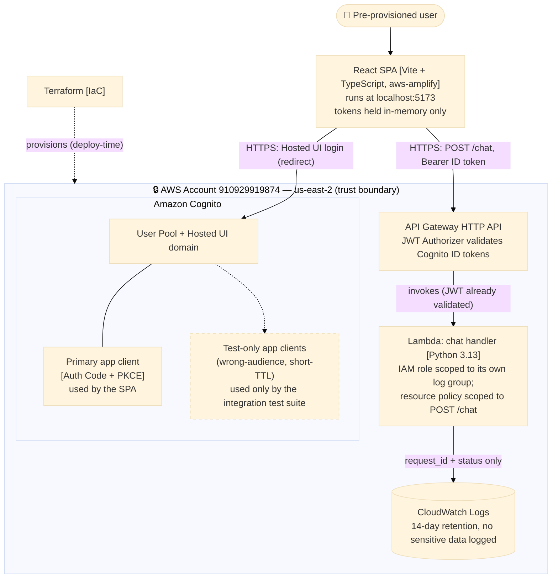
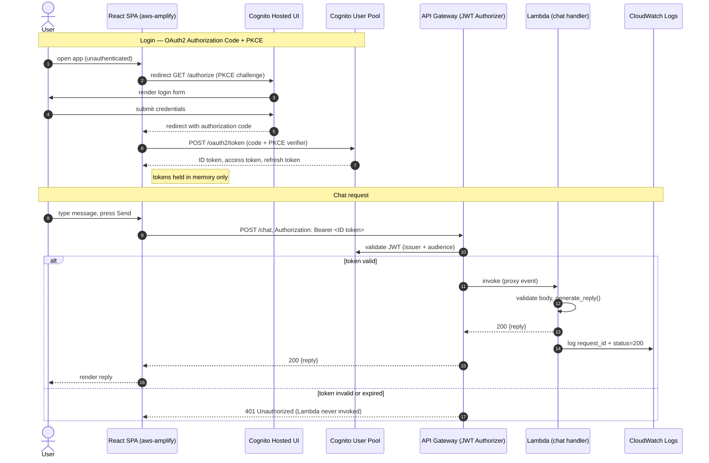

# ohio-ciq-saas

A minimal, Cognito-authenticated chatbot. A pre-provisioned user logs in
through AWS Cognito's Hosted UI, then exchanges chat messages with a
rule-based bot running on AWS Lambda behind API Gateway. See
[`docs/specs/cognito-auth-chatbot/spec.md`](docs/specs/cognito-auth-chatbot/spec.md)
for the full feature contract and [`docs/adr/0001-cognito-auth-chatbot-stack.md`](docs/adr/0001-cognito-auth-chatbot-stack.md)
for why this stack was chosen.

## Architecture

**Deployed topology** — everything runs inside one AWS account/region,
provisioned by Terraform. The frontend never talks to Lambda directly; every
chat request is authorized by API Gateway's JWT authorizer first.



**Request flows** — login is a standard OAuth2 Authorization Code + PKCE
exchange with Cognito; a chat message never reaches the Lambda unless API
Gateway has already validated the bearer token's issuer and audience.



## Setup guide

Follow these steps in order for a first-time deploy and run. Steps 1–6
provision the backend; steps 7–10 run the frontend against it.

1. **Install prerequisites.**
   `terraform`, `aws` CLI (authenticated — `aws sts get-caller-identity` must
   resolve), `jq`, `node` (for the frontend), and `uv` (for backend
   Python tooling).

2. **Initialize Terraform.**
   ```bash
   cd infra/terraform
   terraform init
   ```

3. **Deploy the backend** (creates the Cognito user pool + Hosted UI domain +
   3 app clients, the Lambda + IAM role/policy + log group, and the API
   Gateway HTTP API + JWT authorizer + route + stage — 15 resources into AWS
   account `910929919874`, region `us-east-2`):
   ```bash
   terraform plan     # preview
   terraform apply    # confirm when prompted
   ```

4. **Wait for the stack to become reachable**, then confirm no drift:
   ```bash
   DOMAIN="$(terraform output -raw cognito_hosted_ui_domain)"
   API_URL="$(terraform output -raw api_invoke_url)"
   ./scripts/wait-for-ready.sh "https://$DOMAIN"
   ./scripts/wait-for-ready.sh "$API_URL/chat" 120 POST 401

   terraform plan     # should report "No changes"
   ```

5. **Provision the pre-provisioned test user.** There is no public sign-up —
   enter the password via a non-echoing prompt, never inline (it must never
   appear in shell history):
   ```bash
   read -rs TEST_USER_PASSWORD && export TEST_USER_PASSWORD
   ./scripts/provision-test-user.sh
   unset TEST_USER_PASSWORD
   ```

6. **Generate the frontend's environment file** from the deployed stack's
   outputs (still from `infra/terraform/`):
   ```bash
   cat > ../../frontend/.env.local << EOF
   VITE_COGNITO_USER_POOL_ID=$(terraform output -raw cognito_user_pool_id)
   VITE_COGNITO_CLIENT_ID=$(terraform output -raw cognito_primary_client_id)
   VITE_COGNITO_DOMAIN=$(terraform output -raw cognito_hosted_ui_domain)
   VITE_API_URL=$(terraform output -raw api_invoke_url)
   EOF
   ```

7. **Install and run the frontend:**
   ```bash
   cd ../../frontend
   npm ci
   npm run dev
   ```

8. **Open `http://localhost:5173`.** You're redirected to the Cognito
   Hosted UI to log in.

9. **Log in** with the test user's email and the password you entered in
   step 5.

10. **Send a message** and press Send (or Enter) — the bot's reply appears
    below it. Chat history is not saved; it lives only in that browser tab
    for the session. Click "Sign out" to end the session immediately, or
    close the tab — either way, the next visit requires logging in again.

**Tearing down and recreating the backend** (e.g. to prove the stack is
reproducible), running `checkov`, and the state-loss manual-cleanup fallback
are covered in [`infra/terraform/README.md`](infra/terraform/README.md) —
that file is the canonical infra runbook; this guide only walks the
first-time path end to end. Frontend test/lint/typecheck commands are in
[`frontend/README.md`](frontend/README.md).

## Repository layout

See [`docs/architecture/overview.md`](docs/architecture/overview.md).
